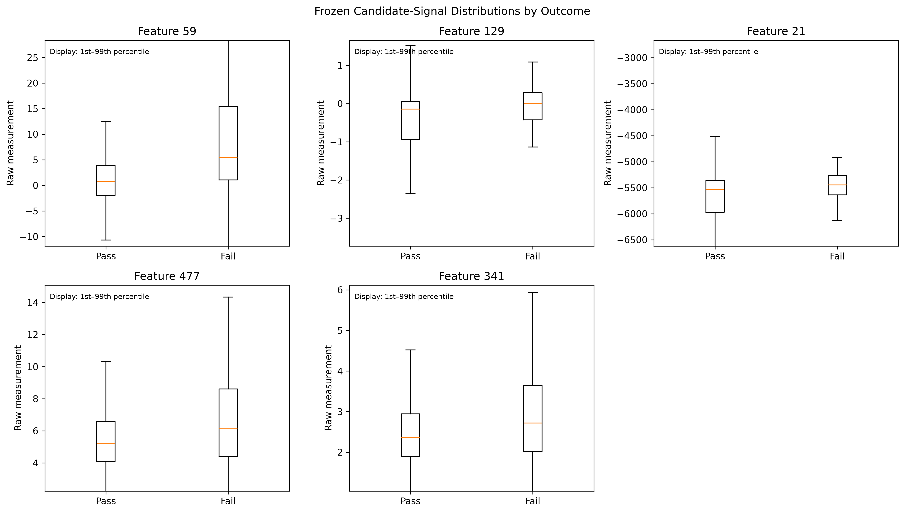
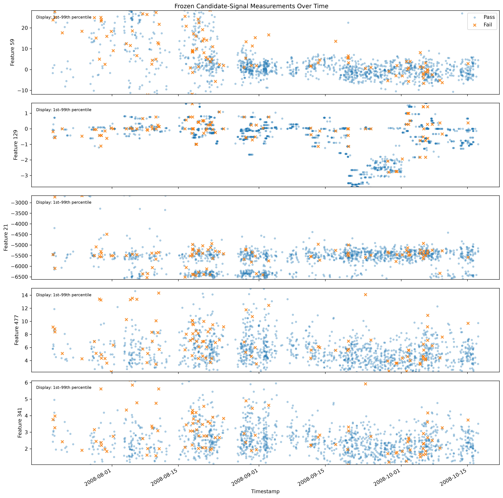

# Semiconductor Manufacturing Yield & Process Excursion Analysis

## Project Objective

This project uses the UCI SECOM dataset to build a reproducible and interpretable workflow for semiconductor manufacturing pass/fail analysis.

The project focuses on:

- Inspecting manufacturing measurement data quality
- Building leakage-safe baselines for imbalanced pass/fail classification
- Evaluating failure detection with appropriate metrics
- Identifying anonymous candidate signals associated with failure outcomes
- Exploring process behavior over time without claiming physical root causes from anonymized data

## Dataset

The UCI SECOM dataset contains:

- 1,567 production samples
- 590 anonymized process measurement features
- Pass/fail labels
- Timestamps associated with each sample

The original label encoding is:

- `-1`: Pass
- `1`: Fail

## Dataset Inspection

Initial inspection produced the following results:

| Item | Result |
|---|---:|
| Samples | 1,567 |
| Anonymous measurement features | 590 |
| Pass samples (`-1`) | 1,463 |
| Fail samples (`1`) | 104 |
| Observed pass yield | 93.36% |
| Observed failure rate | 6.64% |
| Missing measurement cells | 41,951 / 924,530 |
| Overall missing rate | 4.54% |
| Constant features | 116 |
| Near-constant candidate features | 10 |
| Earliest timestamp | 2008-07-19 11:55:00 |
| Latest timestamp | 2008-10-17 06:07:00 |
| Chronologically ordered | Yes |
| Duplicate timestamp occurrences | 33 |

The dataset is strongly class-imbalanced: only 104 of 1,567 samples are failures. Therefore, accuracy alone is not an appropriate measure of failure-detection performance. An always-pass prediction would already achieve approximately 93.36% accuracy while detecting none of the failures.

Missing values are also unevenly distributed across features. Although the overall missing rate is approximately 4.54%, several individual features have missing rates above 85%, including some above 91%.

Near-constant candidates were defined during exploratory inspection as non-constant features whose most frequent observed value accounts for at least 98% of their non-missing observations. This threshold is an exploratory screening rule based on the observed feature distribution, not a physical process specification.

## Milestone 2 — Leakage-Safe Data Preprocessing

A leakage-safe preprocessing workflow was developed for the imbalanced SECOM pass/fail classification problem.

The dataset was split into a stratified 80/20 holdout:

- Training set: 1,253 samples
  - 1,170 Pass
  - 83 Fail
- Test set: 314 samples
  - 293 Pass
  - 21 Fail

The test set is reserved for final unseen evaluation and is not used for preprocessing or model-development decisions.

Model development uses 5-fold stratified cross-validation within the training set.

The preprocessing workflow applies:

1. Removal of features with more than 80% missing values, determined from the data used to fit each preprocessing step
2. Removal of features with no usable observed variation
3. Median imputation for remaining missing values
4. Standard scaling

The greater-than-80% missingness threshold is an MVP analysis policy rather than a universal statistical rule or semiconductor process specification. Median imputation was selected as a simple robust approach after training-only analysis showed substantial skewness among the retained measurement features.

The preprocessing steps are implemented in a scikit-learn `Pipeline` using training-fitted feature filters, `SimpleImputer`, and `StandardScaler`. This allows preprocessing parameters and feature-selection decisions to be learned independently within each cross-validation training fold rather than globally before validation.

Pipeline verification on the holdout training set produced:

- Input shape: 1,253 × 590
- Output shape: 1,253 × 466
- Missing values after preprocessing: 0
- Average scaled feature mean: approximately 0
- Average scaled feature standard deviation: 1.0

Fold-by-fold verification confirmed that preprocessing was independently fitted within each cross-validation training fold. One fold retained 460 features while the other four retained 466, demonstrating that feature filtering can adapt to the observations available in each training fold while applying the same fitted feature set to its corresponding validation fold.

## Milestone 3 — Baseline & Evaluation

Milestone 3 established an interpretable failure-detection baseline and evaluated it using the leakage-safe workflow developed in Milestone 2.

A `DummyClassifier(strategy="most_frequent")` was first used as a trivial majority-class baseline. Because it always predicts Pass, it achieved high cross-validation accuracy while detecting no failures.

A class-weighted Logistic Regression was then combined with the existing preprocessing workflow inside a single scikit-learn `Pipeline`:

1. Remove features with more than 80% training-data missingness
2. Remove features with no usable observed variation
3. Apply median imputation
4. Apply standard scaling
5. Fit class-weighted Logistic Regression

All preprocessing and model fitting were performed independently within each cross-validation training fold.

### Cross-Validation Results

Five-fold stratified cross-validation on the 1,253-sample training set produced:

| Metric | DummyClassifier mean | Logistic Regression mean | Logistic Regression std |
|---|---:|---:|---:|
| Accuracy | 0.9338 | 0.8499 | 0.0170 |
| Balanced accuracy | 0.5000 | 0.5726 | 0.0638 |
| Failure precision | 0.0000 | 0.1403 | 0.0589 |
| Failure recall | 0.0000 | 0.2529 | 0.1315 |
| Failure F1 | 0.0000 | 0.1786 | 0.0796 |
| Average precision | 0.0662 | 0.1600 | 0.0814 |
| ROC-AUC | 0.5000 | 0.6027 | 0.0799 |

The DummyClassifier illustrates why accuracy alone is misleading for this dataset: it achieved 93.38% mean accuracy while detecting no failures.

The Logistic Regression baseline reduced overall accuracy but provided non-zero failure detection and improved balanced accuracy, failure recall, precision, F1, average precision, and ROC-AUC.

Performance varied meaningfully across validation folds. For example, failure recall ranged from 0.0625 to 0.4375. Each validation fold contained only 16 or 17 failures, so this variability is an important limitation when interpreting baseline performance.

### Final Holdout Evaluation

After model-development decisions were complete, the full modeling pipeline was fitted on all 1,253 training samples and evaluated once on the untouched 314-sample holdout test set.

The final confusion matrix was:

    [[259  34]
     [ 17   4]]

with Fail (`1`) treated as the positive class.

Final holdout results:

| Metric | Result |
|---|---:|
| Accuracy | 0.8376 |
| Balanced accuracy | 0.5372 |
| Failure precision | 0.1053 |
| Failure recall | 0.1905 |
| Failure F1 | 0.1356 |
| Average precision | 0.1192 |
| ROC-AUC | 0.6239 |

The model detected 4 of the 21 failures in the final holdout set while producing 34 false-positive failure predictions.

Overall, the class-weighted Logistic Regression showed modest predictive value beyond the trivial majority-class baseline, but failure detection remained limited. It should therefore be treated as an interpretable engineering baseline rather than a production-ready failure detector.

The final holdout results are not used to tune the classification threshold, preprocessing choices, class weights, hyperparameters, or model selection.

## Milestone 4 — Candidate-Signal Analysis

Milestone 4 extended the interpretable Logistic Regression baseline to identify anonymous measurement features that showed consistent associations with failure outcomes.

Candidate-signal analysis was performed using the 1,253-sample training partition only. The final holdout test set was not reused for feature screening.

Three complementary forms of evidence were evaluated:

1. Logistic Regression coefficient direction and magnitude across five cross-validation training folds
2. Training-only Mann–Whitney U analysis with rank-biserial effect size and Benjamini–Hochberg false-discovery-rate correction
3. Validation-fold permutation importance using average precision as the scoring metric

### Multiple-Testing Control

Univariate analysis was performed on 466 retained training features.

- 79 features had raw `p < 0.05`
- 15 features remained significant after Benjamini–Hochberg correction with FDR `q < 0.05`

This demonstrates why unadjusted p-values alone were not used for high-dimensional candidate screening.

### Candidate-Signal Screening

For the MVP, a feature was retained as a candidate signal when it satisfied all three transparent screening criteria:

1. Retained in all five cross-validation training folds with the same Logistic Regression coefficient direction in all five folds
2. Training-only univariate association with FDR `q < 0.05`
3. Positive validation-fold permutation importance for average precision in at least four of five folds

Five anonymous features satisfied all three criteria:

| Feature | Mean CV coefficient | Rank-biserial | FDR q | Mean permutation importance | Positive permutation folds |
|---:|---:|---:|---:|---:|---:|
| 59 | 1.6681 | 0.3193 | 0.000265 | 0.007156 | 4/5 |
| 129 | 1.0279 | 0.2457 | 0.009281 | 0.005921 | 4/5 |
| 21 | 0.7402 | 0.2144 | 0.033701 | 0.007468 | 4/5 |
| 477 | 0.4702 | 0.2777 | 0.002144 | 0.001851 | 4/5 |
| 341 | 0.4017 | 0.2432 | 0.009816 | 0.001759 | 4/5 |

All five candidates had positive Logistic Regression coefficients in all five folds and positive univariate rank-biserial associations.

Training missingness was below 1% for all five candidate features, and all 83 training failures had observed measurements for each candidate.

The generated candidate table is saved to:

`reports/candidate_signals.csv`

This artifact provides a reproducible input for later process/time-oriented visualization.

### Interpretation

The five selected features are described as **candidate signals associated with failure outcomes**.

They are not treated as identified physical root causes.

The screening criteria are transparent MVP analysis policies rather than universal statistical thresholds or semiconductor process specifications. Coefficient magnitude, rank-biserial effect size, and permutation importance also measure different quantities, so the five candidates should not be interpreted as a definitive ordered ranking of physical importance.

## Milestone 5 — Process Monitoring and Time-Oriented Visualization

Milestone 5 extended the frozen Milestone 4 candidate-signal analysis into a descriptive process/time-oriented view of the SECOM observations.

The candidate set was not reselected after inspecting the time-oriented visualizations. The analysis uses the five frozen Milestone 4 candidates from:

`reports/candidate_signals.csv`

The five candidates remain:

- Feature 59
- Feature 129
- Feature 21
- Feature 477
- Feature 341

### Timestamp Structure

Before interpreting candidate measurements over time, the observation timing structure was examined.

Across the 1,566 consecutive timestamp gaps:

- Median gap: 37 minutes
- Mean gap: approximately 82.5 minutes
- Zero-length gaps: 33
- Maximum observed gap: 2 days and 38 minutes

The SECOM observations are therefore chronologically ordered but irregularly spaced in time.

Duplicate timestamps are present, so timestamp is not treated as a unique sample identifier.

Because the sampling intervals are irregular, the formal candidate timelines use scatter-based visualization rather than connecting observations as a continuous measured trajectory.

### Candidate-Signal Distributions

The five frozen candidate signals were compared between Pass and Fail observations using their raw observed measurements.

The formal distribution figure is saved to:

`figures/candidate_distributions.png`

The five candidates generally showed higher raw measurements among Fail observations, consistent with the positive association directions established during Milestone 4.

However, substantial Pass/Fail overlap remained. The candidate signals should therefore not be interpreted as deterministic standalone failure indicators.

For readability, the formal figure displays the combined observed 1st–99th percentile range for each candidate. Measurements outside this display range remain in the dataset and all numerical analyses.

### Candidate Measurements Over Time

The raw observed candidate measurements were also visualized over the complete timestamp sequence.

The formal timeline figure is saved to:

`figures/candidate_timelines.png`

The candidate measurements showed temporal distribution variation, but the patterns were not identical across features.

Examples from the formal chronological-block summary include:

- Feature 59 had a median of approximately 9.62 and an IQR of approximately 19.17 in Block 1, compared with medians near -0.55 to 1.03 and IQRs near 4–5 in Blocks 2–4.
- Feature 129 showed a distinct lower-valued and more dispersed distribution in Block 3, with a median of approximately -2.22 and an IQR of approximately 2.60.
- Feature 21 had IQRs of approximately 900 in Blocks 1–2, compared with approximately 286–323 in Blocks 3–4.
- Features 477 and 341 showed more moderate temporal differences in measurement level and dispersion.

The reproducible numerical summary is saved to:

`reports/candidate_temporal_summary.csv`

### Chronological-Block Analysis

For descriptive temporal comparison, the complete chronological observation sequence was divided into four approximately equal-count blocks.

The block boundaries are a reproducible summary device based on observation order.

They are not interpreted as:

- detected process change points,
- known process regimes,
- excursion boundaries,
- equipment interventions,
- or recipe changes.

A supporting outcome-stratified exploratory check showed that temporal differences remained visible within Pass observations for multiple candidate signals.

This indicates that changing Pass/Fail composition alone does not explain all of the observed temporal variation.

Descriptive within-block Pass/Fail median differences also varied across time blocks. Therefore, the Milestone 4 candidate signals should not be interpreted as temporally invariant standalone failure indicators.

### SPC Decision

Formal statistical process control charts were not introduced for the Milestone 5 MVP.

The anonymized SECOM data does not provide sufficient manufacturing context to define and defend process subgroups, tool or chamber identity, recipe or product context, sampling policy, specification limits, or a known stable baseline period.

The observations are also irregularly spaced and include duplicate timestamps.

For these reasons, Milestone 5 uses descriptive time-oriented visualization and chronological summaries rather than presenting control limits whose process interpretation cannot be adequately justified.

This decision does not establish that the underlying process was stable or unstable. It reflects the limitations of the available anonymized observational data.

### Milestone 5 Outputs

Formal source:

`src/process_monitoring.py`

Generated figures:

- `figures/candidate_distributions.png`
- `figures/candidate_timelines.png`

Generated report:

- `reports/candidate_temporal_summary.csv`

Milestone 5 therefore adds a process/time-oriented perspective to the training-derived candidate signals while preserving the distinction between statistical association, temporal variation, and physical causation.

## Interpretation and Project Scope

This project prioritizes reproducible manufacturing-data analysis, appropriate evaluation for class imbalance, and interpretable engineering conclusions rather than leaderboard-oriented model complexity.

The SECOM measurement features are anonymized and observational. Predictive performance, statistical association, and feature importance do not establish physical causation. Selected measurements are therefore described as **candidate signals associated with failure outcomes**, not identified physical root causes.